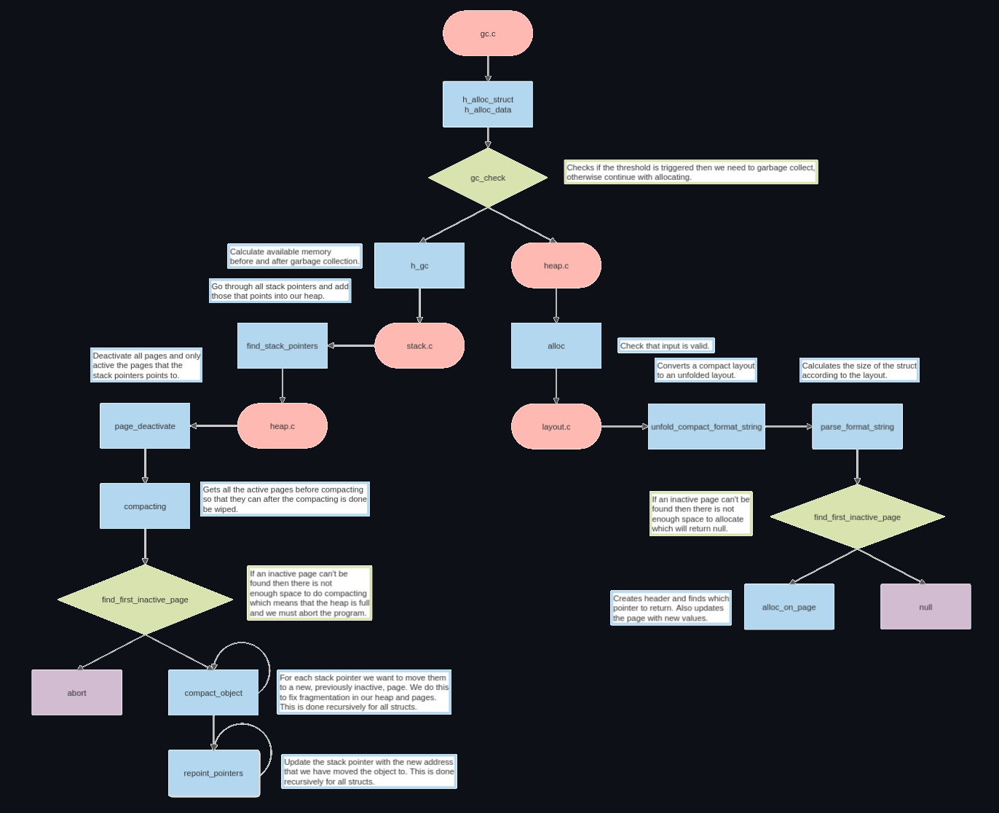

# Design

## Modules

Our Garbage Collector exists of the following modules:
- **gc.c**
- **heap.c**
- **stack.c**
- **layout.c**

#### gc.c

Is the main module and is in the top of the hierarchy. This module will only call on other modules and never be called on.
This module contains the interface that we give to the user for the whole Garbage Collector. 
We designed the functions inside gc.c to be minimal so they are easily understandable but also a clean code.
There is only one function inside gc.c that is not in the header file, which is the gc_check and since it's used in both h_alloc
functions we extracted it into its own function. 

#### heap.c

This module is our largest and contains all the functions for doing operations on the heap and pages.
In this module we find the function for creating the internal_heap which is the actual heap that keeps track of the pages.
We also have the creation of pages, allocating objects on the heap, page deactivation and compacting which are responsible for the Garbage Collection.

#### stack.c

This modules only job is really to find stack variables that are pointers and points into our heap. This is done by going through all stack variables
and then take its pointer value and find which page it would reside on. Then we check that the pointer corresponds to the page's allocation map.

#### layout.c

This module is for manipulating format strings and calculating size of structs from its layout. Usually a layout looks like the struct, e.g "ii*",
but we have support for "2i*". With this support we must convert it from the compact version to the unfolded one when we iterate over the format string
for our recursive compact_object and repoint_pointers functions. The parse_format_string function is also built for the usual layout format so before we
can parse the format string we must unfold it.
