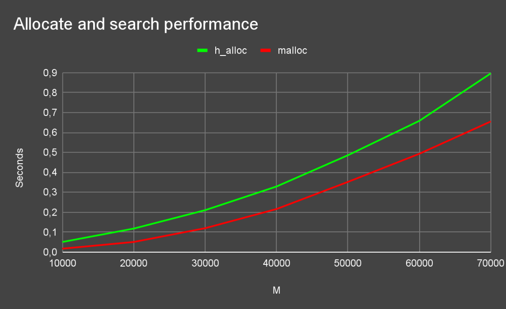
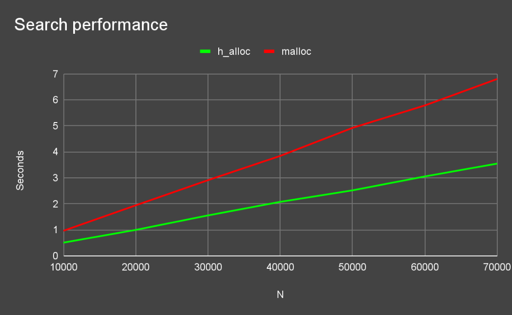

# Code Quality Report

### Kodstandard

Vi har valt att använda den inbyggda C kodstandarden som finns i Microsofts C/C++ extension till VScode.
Vi valde denna kodstandard då majoriteten av gruppen tycker att den är mest läsbar då man har måsvingar på ny rad
men även att den redan finns som standard i C extension:et så det är väldigt smidigt att formatera.


### Namnstandard

Vid skapandet av funktioner som behandlar våra egendefinierade typer så ska dessa funktioners namn börja med typen.
T.ex så har vi page_deactive och page_find som då primärt behandlar en page och gör operationer på den.
Vid mer generella funktioner så har vi satt ett rimligt långt och beskrivande namn för vad funktionen gör.
T.ex unfold_compact_format_string och find_stack_pointers har ett ganska långt namn men det framgår väldigt tydligt vad dem
gör. Det samma gäller för parametrarna och argumenten till funktioner, att det är beskrivande namn så man inte ska behöva gå till
dokumentationen eller funktionen för att förstå vad för argument man ska ange.
T.ex string_to_overwrite och stack_pointers som skulle kunna förkortas till str och sp men det kan vara otydligt.


### Kodkvalité

Då vi bara har runt 760 rader C kod för en fungerande Garbage Collector så tycker vi att det är ett bevis på bra skriven kod.
För att få så lte kod som möjligt utan att börja macho-koda så har abstraherat ut så mycket kod som är rimligt i egna funktioner.
I många funktioner så itererar vi över vår format_string för att rekursivt köra samma funktion för alla struct medlemmarna. 
Detta kan dock inte på något enkelt sätt abstraheras ut till en funktion då det är små skillnader i varje iteration samt olika funktioner som ska köras rekursivt.
Det som vi har lyckats mindre bra med är att vi får många "Uninitialised value errors" när vi köra med Valgrind. Detta grundar sig främst i att vi hittar
"felaktiga" pekare i find_stack_pointers som genererar detta fel då dem avrefereras. 

### Testning

Vi har försökt arbeta på ett sådant sätt att vi efter att ha skrivit någon funktion så skapar vi även tester för denna direkt så att vi dels kan testa
att den uppfyller sin funktion men även att framtida test fungerar. På detta sett så har vi konstant byggt upp regressionstester som kan köras så fort man gör
en större ändring för att säkerställa att allt fortfarande fungerar. 

### Prestanda

Efter att ha skapat våra egna prestandatester där vi jämför vårt program med malloc så kunde vi se att vårt program är generellt långsammare avseende allokeringen och tiden för själva skräpsamlingen.
Men det som vi fann intressant var att vår kompaktering ger snabbare prestanda vid iterering av en länkad lista efter att den har blivit skräpsamlad än vid iterering av en malloc:ad länkad lista.
Detta är p.g.a att vi skapade fyra länkade listor där det var slumpmässigt vilken av dem som fylldes på. Detta bidrog till att de länkade listorna och dess innehåll inte hamnade konsekutivt i minnet utan helt utspritt.
Efter kompakteringen av dem så hamnar dem däremot konsekutivt eftervarandra och därmed så går det snabbare att iterera över dem.



I detta test ökar vi M vilket är antalet allokeringar och antalet sökningar N är alltid M/10.



I detta test är M fast på 70000 och vi varierar N enligt värdena på grafen. Vi kan se att h_alloc nästan alltid är dubbelt så snabb på att söka som malloc efter vi har skräpsamlat. Detta är eftersom vi vid skräpsamling lägger varje lista konsekutivt i heapen.

### Modularisering

Då vår kod är modulariserad fyra olika filer där varje fil har låg coupling då det endast är fåtal
funktioner som kallas emellan modulerna. Undantaget är gc.c som är huvudprogrammet som innehåller det yttersta interfacet som ges till användaren. Så gc.c har hög coupling för den kallar bara på andra moduler och låg cohesion då den inte anropar på funktioner inom sig förutom gc_check. Men i detta fallet så tycker vi att det är bra med hög coupling för gc.c enda uppgift är som sagt att ge
användaren ett interface för Garbage Collectorn.
Resterande filer har hög cohesion då samtliga funktioner körs och kallas på funktioner inom modulen förutom vissa fall för när vi måste konvertera layouten i heap.c.

### Exempel

```c
void *alloc(internal_heap_t *heap, size_t bytes, char *layout)
{
    // bytes is less than 0 or, object is to large for allocating or, bytes and layout is used simultaneously
    if ((int)bytes < 0 || bytes > (PAGE_SIZE - sizeof(meta_t)) || (bytes > 0 && layout != NULL))
    {
        return NULL;
    }

    // bytes == 0 if we want to alloc a struct
    if (bytes == 0)
    {
        // bytes == 0 and layout == NULL, bad input
        if (layout == NULL)
        {
            return NULL;
        }
        
        bytes = parse_format_string(layout);

        // If layout contains invalid char then NULL
        if (bytes == 0)
        {
            return NULL;
        }
    }
    
     
    // Find which page to allocate in
    page_t *current_page = find_first_free_page(heap, bytes);

    // There is not enough space to allocate
    if(current_page == NULL)
    {
        return NULL;
    }
    
    // Update heap size value
    heap->total_avail -= (sizeof(meta_t) + page_allign_bytes(bytes));

    return alloc_on_page(current_page, layout, bytes);
}
```

Vår alloc funktion var tidigare uppdelad i två olika som den är i gc.c, alltså en för alloc_data och en för alloc_struct.
Men då funktionerna gjorde i princip samma sak så slog vi ihop dem och gjorde dem till en där vi lade till några if-satser för att fixa valideringen och kompatibiliteten.
Vi har kommenterat nästan varje rad så att det är lätt att förstå men även så att felsökning och underhåll förenklas.

```c
void *alloc_on_page(page_t *current_page, char *layout, size_t bytes)
{
    // Store meta data
    meta_t *meta_data = (meta_t *)current_page->first_free;
    meta_data->format_string = layout;
    meta_data->size = bytes;
    meta_data->forwarding_adress = NULL;
    meta_data->extra = NULL;

    // Store user alloc
    void *to_return = current_page->first_free + sizeof(meta_t);

    // Makes adresses 16 byte-alligned
    size_t internal_bytes = page_allign_bytes(bytes);

    // Updating page values
    current_page->first_free += (sizeof(meta_t) + internal_bytes);
    alloc_map_set_true(current_page, to_return);
    current_page->active = true;
    current_page->total_alloc += bytes;
    current_page->num_of_objects += 1;

    return to_return;
}
```

Samma som tidigare exempel så var även vår alloc_on_page uppdelad i två olika funktioner där vi använde den ena för första allokeringen av ett objekt och den andra vid förlyttning av ett objekt.
Dem var väldigt snarlika men hade olika signatur samt att heap->total_avail inte skulle uppdateras i den. Men det var lätta förändringar som sparade in många rader kod samt att det blev mer läsbart.

```c
void repoint_pointers(void **pointer_address)
{
    // Take out the pointer to the struct to get correct arithmetic pointer calculations
    void *current_pointer = (void *)pointer_address;
    meta_t *meta = current_pointer - sizeof(meta_t);
    char *format_string = meta->format_string;
    
    // Unfold compact string
    char unfolded_format_string[calculate_layout_length(format_string)];
    unfold_compact_format_string(format_string, unfolded_format_string);

    size_t bytes = meta->size;

    for (size_t offset = 0, i = 0; offset < bytes; offset += parse_format_char(unfolded_format_string[i]), i++) 
    {
        char c = unfolded_format_string[i];

        // If the pointer inside the struct is a pointer, we need to repoint it
        if (c == '*')
        {
            void **old_pointer_address = current_pointer + offset;

            void *old_pointer = old_pointer_address[0];

            // Gets triggered if the previous pointer wasn't set
            if(old_pointer == NULL)
            {
                continue;
            }

            meta_t *old_meta = old_pointer - sizeof(meta_t);

            void *new_pointer = old_meta->forwarding_adress;

            if(new_pointer == NULL){
                continue;
            }
            // Update the pointervalue to the new pointer
            *(old_pointer_address) = new_pointer;

            if (old_meta->format_string != NULL)
            {
                repoint_pointers(new_pointer);
                old_meta->format_string = NULL;
            }
        }
    }
}
```

Vi har insett under utvecklingensgång att det ofta finns structar som pekar vidare till andra objekt eller structar och insåg redan då att rekursion är ett simpelt och smidigt sätt att lösa det på.
Därmed har vi eftersträvat att använda rekursion så ofta det går trots att det är något sämre prestandamässigt så är det argumenterbart mer läsbart och kortare kod.
Repoint_pointers är en av dessa rekursiva funktioner som vi är stolta med som löser många problem på få rader. Det den gör är att gå igenom en structs medlemmar och ifall det är en pekare så ska den pekas om till dess forwarding_adress.
Sen kollar vi om struct medlemmen som var en pekare även själv är en struct, d.v.s har en format_string, isåfall anropar vi rekursivt på repoint_pointers och gör samma sak för den.
