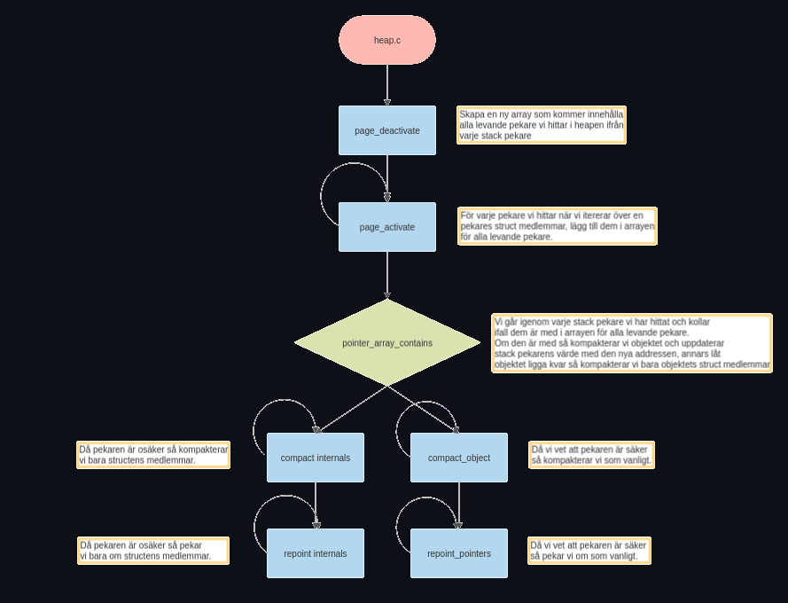
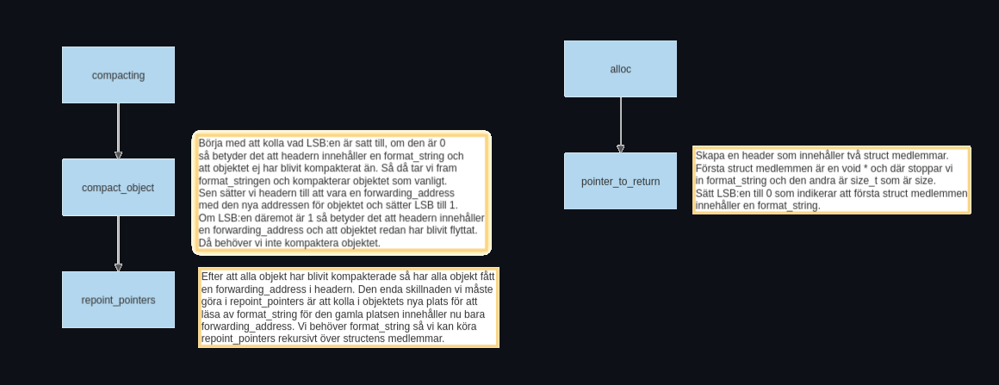

# Deviations

## Support för osäkra pekare

### Anledning

Vi har ej implementerat stöd för osäkra pekare av två anledningar. Risken att en osäker pekare skulle vara ett problem för programmet är oerhört liten då vi har en allokeringskarta som säger vart pekare finns allokerade i heapen. Det enda fallet är alltså då en int på stacken har exakt samma värde som en pekare allokerad på vår heap. Det skulle endast vara ett problem om programmet man använder är väldigt stort. Vi har inte heller tillräckligt med tid för att implementera detta då fokuset måste gå till att skriva rapport och förbereda presentation. 

### Implementation

Det finns två huvudsakliga funktionaliteter med detta som vi hade behövt implementera. Den första är att inte flytta på objekt som pekas på av en osäker pekare. Detta anser vi inte är svårt att implementera då det i princip går ut på att skippa ett steg i vår kompaktering där stackpekare pekas om. Det svåra och vad som skulle ta mest tid är att hålla kolla på vilka pekare som är säkra eller osäkra. Vår ide är att när vi itererar över stackpekare och hittar allt levande så kan vi spara dessa pekare i en array, alltså bara pekare inom heapen, inte stackpekarna själva. När vi sedan ska flytta stackpekare kan vi kolla om den pekaren är med i vår array. Är den det så kan vi anse den som säker och då flytta den vid kompakteringen annars låter vi den stå kvar och flyttar endast det som den pekare vidare på. Vi tror att detta skulle ta ungefär 20h att implementera, där stor del av tiden går till att ändra delar av vårt program som redan fungerar.

### High-level design

## Bitvektor för headern

### Anledning

Vi har ej använt de minst signifika bitarna i vår addresser för att bestämma vad meta datan för ett objekt är. Detta är mest pga tidsbrist eftersom implementationen av detta skulle leda till väldigt mycket ändringar på andra delar av projektet. Vi valde från början att använda en meta strukt som håller koll på format_string och forwarding_address som är mindre minneseffektivt men målet var att få ett fungerande projekt.

### Implementation

Tanken med bitvektorn är att kunna representera meta data inom endast sizeof(void *) men vi har just nu meta data storlek på 32 bytes vilket är 4 * sizeof(void *). Vi skulle därför kompromissa lite och istället använda bitvektor för att minska meta data till 16 bytes där första fältet är en void * och det andra är storleken på objektet. Detta är ett krav eftersom vår heap är indelad i 16 byte områden som korrelerar till allokeringskartan. Att arbeta på bitnivå har vi redan gjort med allokeringskartan så att manipulera de minst signifika bitarna känns möjligt. Det svåra med denna implementation är att mycket måste ändras i vår kompakteringskod. Vi måste nu ta hänsyn till att första fältet i metadatan endast kan vara en av format_string och forwarding_adress men det är möjligt att lösa. Vi har dock inte tid med alla buggar som förmodligen skulle uppstå. Vi tror att detta skulle ta ungefär 18h att implementera, där stor del av tiden går till att ändra delar av vårt program som redan fungerar.

### High-level design

