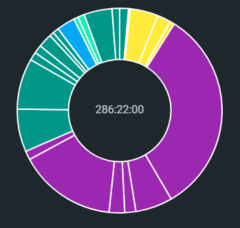
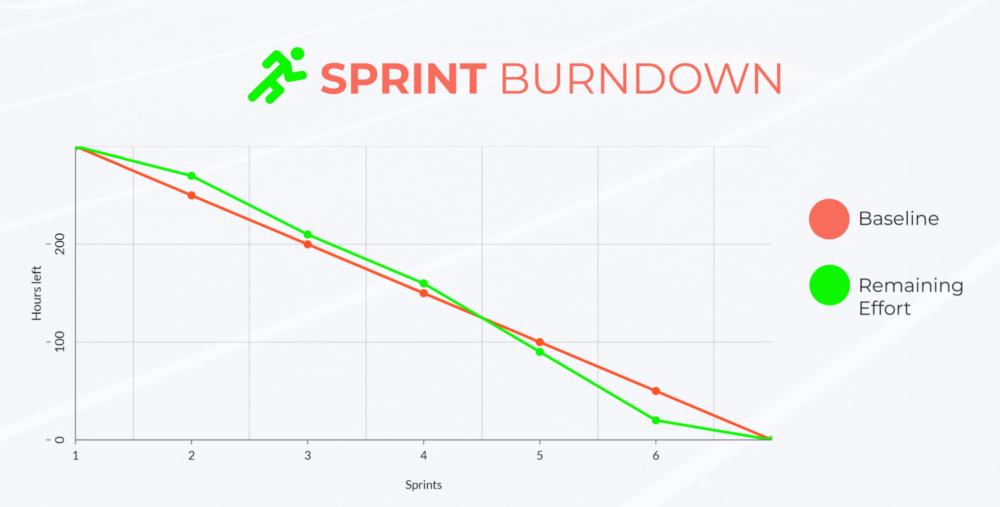

## 1 Omegalul

### 1.1 Medlemmar

<table>
  <tr>
   <td><strong>Name</strong>
   </td>
   <td><strong>Email</strong>
   </td>
   <td><strong>Active Dates</strong>
   </td>
  </tr>
  <tr>
   <td>William Forslund
   </td>
   <td>william.forslund.0576@student.uu.se
   </td>
   <td>30/11 2022 - 10/1 2023
   </td>
  </tr>
  <tr>
   <td>Israa Aly Abdou
   </td>
   <td>israa.alyabdou.7222@student.uu.se
   </td>
   <td>30/11 2022 - 10/1 2023
   </td>
  </tr>
  <tr>
   <td>Joel Holmberg
   </td>
   <td>joel.holmberg.3687@student.uu.se
   </td>
   <td>30/11 2022 - 10/1 2023
   </td>
  </tr>
  <tr>
   <td>Anton Rodell
   </td>
   <td>anton.rodell.3644@student.uu.se
   </td>
   <td>30/11 2022 - 10/1 2023
   </td>
  </tr>
  <tr>
   <td>Erik Odhner
   </td>
   <td>erik.odhner.6553@student.uu.se
   </td>
   <td>30/11 2022 - 10/1 2023
   </td>
  </tr>
  <tr>
   <td>Josef Tiljander
   </td>
   <td>josef.tiljander.3912@student.uu.se
   </td>
   <td>30/11 2022 - 10/1 2023
   </td>
  </tr>
</table>

## 2 Kvantitativt Arbete

Projektet har genomförts på en period bestående av 6 veckor. Vårt arbete har under denna tid utförts i 6 sprintar där varje sprint bestått av en arbetsvecka. Den 30:e november började arbete med projektet vilket också markerar starten för vår första sprint. Komplett info om sprinten med dess datum  har sammanställts i tabell 1. Projektets sista sprint och således projektet avlutades den 10 januari. 

<table>
  <tr>
   <td>Sprint
   </td>
   <td>Startdatum 
   </td>
   <td>Slutdatum
   </td>
   <td>längd(dagar)
   </td>
  </tr>
  <tr>
   <td>1
   </td>
   <td>30/11
   </td>
   <td>2/12
   </td>
   <td>3
   </td>
  </tr>
  <tr>
   <td>2
   </td>
   <td>5/12
   </td>
   <td>9/12
   </td>
   <td>5
   </td>
  </tr>
  <tr>
   <td>3
   </td>
   <td>12/12
   </td>
   <td>16/12
   </td>
   <td>5
   </td>
  </tr>
  <tr>
   <td>4
   </td>
   <td>19/12
   </td>
   <td>23/12
   </td>
   <td>5
   </td>
  </tr>
  <tr>
   <td>5
   </td>
   <td>26/12
   </td>
   <td>30/12
   </td>
   <td>5
   </td>
  </tr>
  <tr>
   <td>6
   </td>
   <td>2/1
   </td>
   <td>10/1
   </td>
   <td>8
   </td>
  </tr>
</table>

Tabell 1. Våra sprintar och dess varaktighet.

Arbetet med projektet har sammanräknat tagit oss 285 arbetstimmar. Gc biblioteket som tagits fram består av totalt 744 rader c kod. För att underlätta körningen och testningen av arbetet har vi använt makefiler på totalt 58 rader kod. arbetet med koden har skett på github, där vi har spårat antalet commits till 151, antalet pull requests till 14, samt antalet issues till 12. 

## 3 Processen

### 3.1 Val av process

Efter lite påläsning valde vi följa Scrum/Kanban metoderna, då dem är enkla att följa och ger bra överblick av arbetet under projektets gång. Vilket vi tyckte var relevant för ett större projekt. Vi kunde sen planera arbetet utifrån metoderna. Vi använde även Trello vilket är väldigt inspirerat av Kanban.

### 3.2 Implementation

Under första gruppmötet diskutera vi arbetsprocessen och valde att en sprint motsvarar en vecka. Hittills har vi haft 5 sprinter totalt med start- och slutmöten. Inför varje sprint skapade vi en tavla i Trello och tilldelade tasks. Scrum/Kanban metoden funkade väldigt bra och nådde dess ändamål. Dock, insåg vi att fler stand-up möten hade gynnat arbetet. Vi hade då kunnat diskutera implementationsdetaljer istället för att diskutera sådant på Scrum-möten. Scrum-möten borde varit inriktade på planering och uppföljning och mindre om projektets detaljer. Hade vi kunnat börjat om med projektet så hade vi planerat in fler Scrum-möten och haft kvar samma arbetsprocess.

 

I starten gjorde vi grova planeringar för de två första sprintarna där det blev mycket ändringar när vi väl börjat koda. De flesta grova designvalen togs vid det första designmötet av gruppen tillsammans. När varje person i sin tur jobbar på en viss modul tog den beslut om implementationsdetaljer själv. De tre sista sprintarna planerades på Scrum-mötet i början av den sprinten. Vi följde planeringen väldigt nära i de första 3 sprintarna, sen kom julen och då är det rimligt att halka efter lite. Vi försökte planera på ett sätt så att vi fick lite tid över för att vara lediga, men att mellandagarna ändå skulle kunna arbetas på.

Första sprinter var det svårt att uppskatta hur stor varje ticket borde vara och hur lång tid en ticket skulle ta. När vi hade väl kommit igång med kodningen insåg vi att vissa tickets var större än vad man trodde och skulle behövas bryta ner till fler tickets. Andra tickets var mycket enklare än vad man först trodde,vilket var bara positivt eftersom man kunde då arbeta en annan ticket. Efter första sprinten kunde vi sen göra om planeringen så att den låg på en lagom detaljnivå. Längden av varje sprint och antal sprintar var vi nöjda med. 

Vi loggade tiden vi arbetade med projektet under olika rubriker, med hjälp av appen Clockify. I figuren nedan ser man tidsfördelningen mellan implementering, research, testning, debugging, design, review av pull requests, report, möten och dokumentation.

Den lila regionen är implementation och de olika indelningarna av den baseras på vad som gjordes samtidigt. T.ex. är en av de mindre regionerna av lila implementation och debugging som har rapporterats samtidigt. Det gula är dokumentation, det ljusblåa är report och cyan är research. Testing och möten delar tyvärr samma färg men den vänstra regionen är möten medan den övre är testning.

Denna burndown chart representerar antalet timmar vi tillsammans spenderat på varje sprint. Den är beräknad enligt antalet timmar det faktiskt tog att slutföra projektet. Vi kan se att majoriteten av timmarna är lagda i sprint 4 och 5. Detta beror främst på att under sprint 4 implementerade vi kompakteringen, vilket är en komplicerad algorithm, samt att vi integrerade med inlupp2 under sprint 5.

## 4 Hjälpmedel

Under planeringsfasen så insåg vi att för genomförandet av processen så behövde vi organisera gruppens arbete till att ske på vissa plattformar. en huvuddel av vårt projektarbete är själva koden som arbetades fram med hjälp av Github. Githubs funktioner främjade arbetsprocessen väl. Det hjälpte dels mycket med själva centraliseringen av kod så att implementationen fanns tillgänglig för alla. Då vi arbetade inom mindre teams så var det också bra med repos och verision kontrollen via branches av kod. Den iterativa processen med scrum gynnades också av tex funktioner som buggrapport. Efter att en bugg upptäckts kunde ett issue skapas som sedan blev ett task i trello. 

Trello är den andra plattformen som vi använde för att jobba med vår valda process. På trello organiserades gruppens uppgifter och vem som gör vad. Detta var viktigt för oss, där vi implementerade en planering för vår första sprint väldigt tidigt i arbetet med projektet. Under planering av sprintar kunde vi lista saker som behövdes göras, dessa omarbetades sedan till så kallade tasks som listades i trello. Dessa allokeras sedan en eller flera personer till under den kommande sprinten. Organiseringen av vad som behövdes göras och vem som skulle arbeta  med det i form av tasks i trello hjälpte arbetet dels genom att vi hade en struktur att kartlägga och planera kommande arbete. Trello såg till att vi inte arbetade flera separat separat eller ingen alls med task. När en uppgift hade slutförts, behövde arbetet inte stoppas utan man kunde lätt välja och fortsätta med ett nytt task från trello.

För att genomföra detta arbete behöver vi en plattform för kommunikation, eftersom vi hade behov av att både kunna skriva till varandra men också kunna utföra möten på distans valdes discord. Discord var en mycket lyckad implementation för kommunikation, då dess stöd för text, röst och video fungerade bra för oss. Plattformen har använts flitigt för att organisera gruppens arbete genom att planera möten men också för att utföra dessa möten digitalt. Då möten och arbete gjordes via discord fungerade detta bra, t.ex. via skärmdelning som gjorde det väldigt lätt att visa t.ex. kod eller körning av program.

En annat behov som vi hade var att spåra tiden som vi arbetade, därav användes clockify. På clockify spårade vi tiden som gruppen lagt på projektet. Plattformen är bra då den är relativt lätt att använda och sammanställer datan för aktiviteter och medlemmar. Arbetet har underlättats stort av dessa plattformar och vi som grupp känner nöjda med valen och användandet. Något som kom upp i samband med användandet av clockify var dock att det inte alltid rapporterades tid för att man glömde eller inte tänkte på att rapportera tiden, Det skulle eventuellt vara intressant med att ha arbetat med att ha en plattform med tidspårningne integrerat tillsammans med planeringen. 

## 5 Kommunikation, Samarbete och Koordination

All kommunikation har skett över discord och har fungerat relativt bra. Utanför jullovet är många bra på att svara snabbt men under jullovet blev det lite sämre vilket var väntat och acceptabelt enligt överenskommelse. Vi har även mailat Elias som svarar snabbt. Ett förbättringsförslag är att tilldela en coach som har tidigare arbetat med samma projekt, eftersom coachen hade svårt att svara på vissa frågor. I övrigt var vi väldigt nöjda med coachen.

Samarbetet i gruppen är väldigt baserat på kommunikationen och där skulle vi kunna gjort bättre med fler stand-up möten. Även koordination inom gruppen med avseende till tekniska aspekter har funkat relativt bra. Under julen hade vi bestämt att arbeta på projektet när man hade tid över. Kommunikationen och samarbetet funkade relativt bra, med tanke på att det blev för lite ledigt. Det mesta har flutit på bra och inga riktiga konflikter har uppstått för eller mellan gruppmedlemmar. I övrigt har vi lärt oss att ha mer kommunikation i framtida projekt, både genom chatt och möten. 

## 6 Arbetsstruktur

I början av projektet var det svårt att veta hur moduler skulle se ut och hur lång tid de skulle ta att implementera. Vi började därför projektet med att jobba tre och tre där ena gruppen arbetade på heapens initiala funktionalitet. Exempelvis skapa heap, riva ner heap och allokera. De andra tre arbetade med att hitta stackpekare som pekar in i vår minnesarea. Detta användes i starten av projektet för att få en bättre blick över hur moduler ser ut och hur mycket tid delar av projektet kommer att ta. Med denna kunskap kunde vi istället gå över till mer individuellt arbete där uppgifter blev till tickets på trello och alla hade bättre koll på hur lång tid dessa tickets skulle ta. Det tillkom uppgifter som innebar att nollställa heapen, iterera över den, och skräpsamla. Mot slutet av projektet övergick vi till mer enat arbete med t.ex. presentationen och rapporten men behöll fortfarande några individuella tickets angående kodskrivande eller refactoring.

Att balansera arbetsbelastningen och storleken på uppgifter var till en början väldigt svårt. Det blev tydligare under projektets gång och om någon kände att en specifik uppgift var för stor så försökte vi dela upp den i mindre delar eller jobba tillsammans för att lösa den. Det blev ofta parprogrammering när större algoritmer skulle implementeras då man kan diskutera ideer med varandra. Om det fortfarande kändes oklart tog man upp det med resten av gruppen.

## 7 Kvalitetssäkring

Vi hade ett långt möte med en väldigt lång diskussion om vår high-level design precis i början av projektet, där vi även diskuterade detaljer på lägre nivå om vi kände oss säkra på att vi förstått ett segment av specifikationen. Detta möte hjälpte oss att få en bra överblick av projektet och det, i kombination med att vi utförde omfattande research på skräpsamlingsalgoritmen, ett möte med vår projektcoach samt att vi drog inspiration från konversationer med andra projektgrupper, ledde till en god nog förståelse för projektuppgiften för att känna oss relativt säkra på korrektheten i vår grundplanering. Med grunden för projektets planeringen lagd kände vi att det fanns ett visst utrymme för eventuella specifikationskompromisser, där specifikationen är otydligt eller svårtolkad, utan att programmets huvudsakliga funktionalitet kompromissas på något avsevärt sätt.

I projektets helhet har vi högt förtroende för kvaliteten på produkten vi har skapat då vi har utfört kvalitetssäkringen löpande under projektets gång. Detta exemplifieras bland annat av enhetstester för de olika modulerna och integrationstester för modulernas samverkan med varandra, vilket går att läsa mer om i projektets testrapport (se /proj/test_report.md i github repot). Dessa har automatiserats med hjälp av en makefil och tjänat ytterligare ett syfte som regressionstest som körs före och efter en förändring i kodbasen för att detektera vad förändringarna åstadkommit med avseende på testerna. 

Generellt sett har de som ansvarat för koden för en viss modul skrivit den största andelen enhetstester för denna, i samband med utvecklingen.

* heap_tests.c skrevs av William, Anton och Erik
* stack_tests.c skrevs av Josef, Joel och Israa

I samband med att det var dags för implementation av själva skräpsamlingsalgoritmen så påbörjades integrationstestning mellan modulerna parallellt med utvecklingen av skräpsamlaren. Även delar av kodbaserna för respektive moduls tester migrerades så småningom till separata sviter i en och samma testfil. 

* unit_tests.c skrevs av Josef, Erik, William och Joel

Till stor del har den löpande kvalitetssäkringen även bestått av pull requests i github. Dessa görs efter att något vettigt arbete har utförts i en branch som någon annan bör titta på innan man gör en merge med main. Dessa kan vara mer eller mindre utförliga men för att exemplifiera bägge ändar av spektrumet kan vi titta på följande pull requests:

* Bäst: Stack_pointers, Added stack crawler, updated heap_dbg to use it. 2 integration tests in stack_tests.c (passes w.o. memleak). Lite vagt namn men bra beskrivning. 
* Sämst: Bartlett compacting. Utan beskrivning. Det är väldigt mycket som har implementerats vilket kräver en beskrivning. 

Totalt har vi gjort 12 stycken pull requests varav 10 stycken godkändes, en godkändes inte och en togs bort av skaparen innan någon hann titta på den. Att jobba med pull requests ger också ett sunt förhållande till växande kodbaser då man inom projektgruppen kontinuerligt behöva granska varandras kod. Det leder naturligt till att det blir ett kollektivt ansvar för kodkvalitén mellan alla inblandade. Utöver detta främjar även pull requests regressionstestning då det blir mycket tydligt vilka ändringar som orsakar vilka förändringar med avseende på testerna. Den pull requesten som inte godkändes gjorde det av just den anledningen, att ett antal tester slutade passera vilket är en indikation på antingen felaktig implementation eller att nya buggar uppstått, förutsatt att testerna är korrekt skrivna. 

## 8 Reflection

I helhet så är vi rätt nöjda med projektet och processen men det finns såklart även andra delar som kan förbättras som vi kan ta med oss till framtida projekt som kräver mycket samarbete. Nedan har vi reflekterat över vissa aspekter av projektet.

**Process:**

Själva processen med Scrum och Kanban funkade väldigt bra men vi hade för få stand-up möten vilket påverkade betyget. Med dagliga stand-up möten hade betyget blivit  7.

Betyg: 6

**Slutprodukt**

Efter integrationen har vi ett väl fungerande program som inte avviker avsevärt från specifikationen.  

Betyg: 6

**Kvalitetssäkring:**

Vi har reviews på alla PR och och tillämpat kodgranskning och testning löpande och har därmed högt förtroende på kvaliteten på koden. Många buggar kom fram under integration med inlupp 2. Hade modulerna testats bättre innan integration hade betyget varit 7. 

Betyg: 6

**Fördelar med programmet:**

Vi har ett fungerande program och det är vi väldigt nöjda med. Det är även skrivet på få antal rader med väldigt läsbar och förståelig kod. 

**Nackdelar med programmet:**

Programmet är väldigt minnesineffektivt. Vi såg till att alltid hålla programmet så enkelt som möjligt och inte alls fokusera på optimering. Detta pga att vi visste redan innan att projektet skulle ta lång tid. Vi fortsatte därför köra på enkel kod över effektiv kod för att leverera en fungerande produkt. Detta har lett till att exempelvis meta strukten är 32 bytes, och eftersom den placeras framför varje objekt i heapen blir overhead väldigt stort.

Vi hittade några problem med programmet mot slutet av projektet som vi inte hann fixa. När vi kör prestanda test med många allokeringar i en länkad lista får vi stack overflow när vi försöker skräpsamla. Detta är pga att vi har rekursiva funktioner som skapar för många stackframes. Det andra problemet har med struktpadding i c att göra. Vi får felaktiga pekare när vi t.ex. har en strukt med en int och en pekare då c lägger till padding mellan dem så att de är word-allignat. Detta är inget vi tagit hänsyn till när vi beräknar offset mellan typer men har löst genom att använda long istället för int.

Valgrind ger även errors när vi kör minnestester. Vi får inga minnesläckor men alla fel vi får kommer från oinitierat minne. Det är två fel som uppstår: "Conditional jump or move depends on uninitialised value(s)" och "Use of uninitialised value of size 8". Problemen kommer i samband med att vi hämtar pekare från stacken. De flesta felen förekommer då vi försöker ta reda på om en pekare faktiskt pekar in i heapen. Men några av dessa oinitierade pekare verkar dock räknats som valida och då får vi även errors i samband med skräpsamlingen. Programmet fungerar som det ska även om man använder oinitierat minne så det är mer som en varning från valgrind. 

**Slutsats:**

Utöver dessa punkter kan vi säga att det var en väldigt stort projekt på kort tid, men trots det är den väldigt lärorikt i implementering av kod, samarbete och även projektplanering. Vi har fått testa nya processer och platformer för att organisera och effektivisera arbete. Många av dessa lärdomar kommer vi ta med till framtida projekt. 
